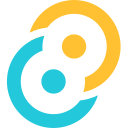
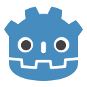
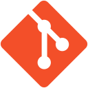

# Oliver

Building useful software across product, automation, and applied AI.

Product-minded and hands-on, I like turning rough workflows into straightforward software.

## Toolkit

**Languages**

  
  
  
  
  <picture>
    <source media="(prefers-color-scheme: dark)" srcset="assets/icons/gdscript-dark.svg">
    
  </picture>
  <picture>
    <source media="(prefers-color-scheme: dark)" srcset="assets/icons/rust-dark.svg">
    
  </picture>
  <picture>
    <source media="(prefers-color-scheme: dark)" srcset="assets/icons/bash-dark.svg">
    
  </picture>
  
  

**Frameworks and platforms**

  
  <picture>
    <source media="(prefers-color-scheme: dark)" srcset="assets/icons/nextjs-dark.svg">
    
  </picture>
  
  
  <picture>
    <source media="(prefers-color-scheme: dark)" srcset="assets/icons/authentik-dark.svg">
    
  </picture>
  
  
  
  <picture>
    <source media="(prefers-color-scheme: dark)" srcset="assets/icons/roblox-studio-dark.svg">
    
  </picture>

**Tools**

  
  
  

[tandemry.dev](https://tandemry.dev)
